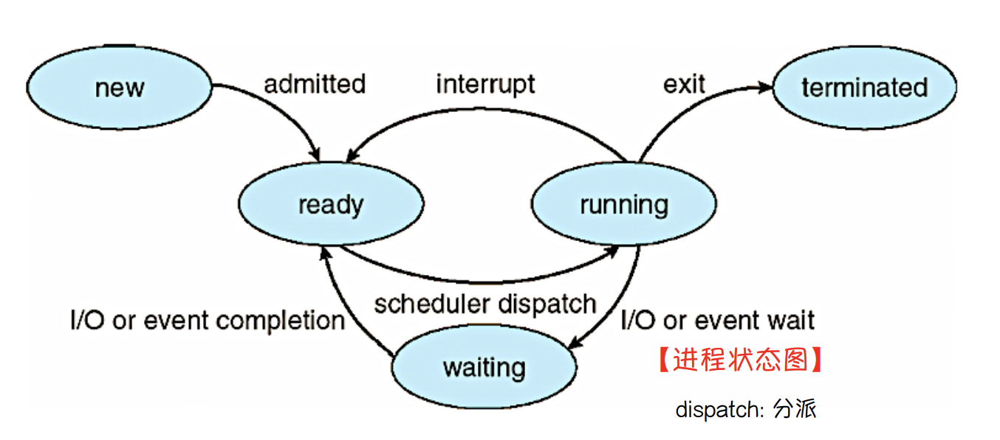

### 进程

#### *the definition of process and its constitution

**Def**: The abstraction provided by the OS of a running program is something we will call a process.

**constitution**:

address space(the memory that the process can address): 

> Instructions lie in memory, the data that the running program reads and writes sits in memory as well.

some special registers:

> 1. program counter(PC) / instruction pointer(IP) tells us which instruction of the program will execute next. 
>
> **There are just counter or pointer to program or instruction, not the program or instruction itself.**
>
> 2. stack pointer and associated frame pointer, they are used to manage the stack for function parameters, local variables, and return addresses. 

Also persistent storage devices

> Such I/O information might include a list of the files the process currently has open.

#### Def of process：执行中的程序

1. 代码段（code section） 又称文本段（text section），通过程序计数器和处理器寄存器 的内容来表示当前活动（current activity) 
2. 数据段（data section）：**存储永久数据** 包含全局变量，静态变量
3. 栈 (stack)  ：**存储临时数据** 如函数参数，返回地址，局部变量，该线程使用的寄存器信息
4. 堆 (heap) ： 在进程运行期间动态分配的内存

##### 线程之间共享的内容

**ppt标准答案**：

1. 代码段，数据段 

2. 打开的文件标识符

> 如果程序在运行过程中打开了一些文件，那么进程地址空间中还保存有打开的文件信息，进程打开的文件也可以被所有的线程使用，这也属于线程间的共享资源。

3. 工作环境，包括当前目录，用户权限等

**个人理解**：

共享资源：代码段、数据段、堆区一定共享，进程打开的文件

私有资源：线程上下文（包括: 线程的栈区（存放函数的参数值、局部变量的值）、程序计数器、栈指针以及线程运行使用的寄存器）

特殊情况：线程与线程之间是没有隔离的，虽说每个线程有自己的工作栈空间，但是线程A去访问线程B的工作栈空间也是可以做到的。某个线程的行为可能影响到进程内其他的线程。


#### *Policies and mechanisms

OS will need both some low-level machinery (mechanisms) and some high-level intelligence (Called Policies).

> Mechanisms are low-level methods or protocols that implement a needed piece of functionality.
>
> Policies are algorithms for making some kind of decision within the OS

For example, time sharing is **"mechanisms"**. And scheduling policy is **"policies"**.

>Because at scheduling policy in the OS will make this decision about which program to run
>
>And time sharing mechanism implement the context switch.

##### *SEPARATE POLICY AND MECHANISM（即系统设计中的机制与策略**分离**的思想）

For example:

mechanism is like providing the answer to a how question about a system;

>how does an operating system perform a context switch?
>
>(The answer is **time sharing**)

policy is like providing the answer to a which question;

>which process should the operating system run right now?
>
>(The answer is **scheduling policy**)

#### 进程控制块 PCB

进程在操作系统中体现的数据结构

包含：<font color=red>进程ID，进程状态，进程计数器，cpu寄存器，cpu调度信息等</font>

<font color=red>创建进程是重量级的操作过程</font>

##### 进程状态



#### 进程调度

##### 进程调度队列

<font color=red>就绪队列(驻留在内存中的就绪并等待运行的进程)；设备队列(等待特定IO设备)</font>

##### 调度程序

长期调度程序：存储设备的缓存池-->ready queue

中期调度程序(分时系统)：将进程从内存中移出(从CPU竞争中移出)

短期调度程序：ready queue-->分配cpu


##### 上下文切换

#### 进程操作

##### 进程创建

一个进程可以创建另一个新进程，那么，创建的进程成为父进程，被创建的新进程称为子进程

##### 进程终止

如果一个进程终止，它的所有子进程也将终止，这种终止被称为级联终止

**僵尸进程**：子进程比父进程先结束，而父进程又没有回收子进程，释放子进程占用的资源


#### *Some Idea about Process API

We first give some idea of what must be included in any interface of an operating system. These APIs, in some form, are available on any modern operating system.

**Create**: Interfaces to create new processes

**Destroy**: Interfaces to destroy processes forcefully

**Wait**: Interfaces to wait for a process to stop running

**Miscellaneous Control**: Other than killing or waiting for a process, there are sometimes other controls that are possible. For example, most operating systems provide some kind of method to suspend a process (stop it from running for a while) and then resume it (continue it running).

**Status**: There are usually interfaces to get some status information about a process, such as how long it has run for, or what state it is in.

####  *Process Creation: A Little More Detail

1. Loading process: Load code and static data from disk(e.g. flash-based SSD) into memory **eagerly(usually in early/simple system)** or **lazily(modern OS)**

2. Creating and initializing a stack: C programs use the stack for local variables, function parameters, and return addresses, also for **argc value and the pointer to argv array**.

   >```shell
   >#using pstack to track the stack of a process
   >pstack 5490
   >#0  main (argc=-1, argv=0x7ffc03c64590) at /tmp/tmp.YhqTGQ2uTe/check_stack.c:13
   >```

3. Allocate some memory for the program’s heap

4. Doing other work as related to I/O setup: For example, in UNIX systems, each process by default has three open file descriptors, for standard input, output, and error; these descriptors let programs easily read input from the terminal and print output to the screen.

5. Start the program running at the entry point, namely main()

#### *Data structure of a process in xv6 kernel

```c
// the registers xv6 will save and restore to stop and subsequently restart a process
struct context {
    int eip;
    int esp;
    int ebx;
    int ecx;
    int edx;
    int esi;
    int edi;
    int ebp;
};
// the different states a process can be in
enum proc_state { UNUSED, EMBRYO, SLEEPING,
RUNNABLE, RUNNING, ZOMBIE };
// the information xv6 tracks about each process
// including its register context and state
struct proc {
    char *mem;				 		 // Start of process memory
    uint sz;						// Size of process memory
    char *kstack;			 		 // Bottom of kernel stack for this process
    enum proc_state state;			  // Process state
    int pid;						// Process ID
    struct proc *parent; 			 // Parent process
    void *chan; 					// If !zero, sleeping on chan
    int killed; 					// If !zero, has been killed
    struct file *ofile[NOFILE];		 // Open files
    struct inode *cwd;				// Current directory
    struct context context;			// Switch here to run process
    struct trapframe *tf;			// Trap frame for the current interrupt
};

```


#### 进程间通信

##### 消息传递

数据少，要内核，容易

###### 直接通信

需要明确接受者和发送者，因此有两种方式：

1.对称寻址

2.非对称寻址（接收者不需要命名发送者）

###### 间接通信

两个进程共享一个端口即可

###### 同步异步

发送者：1. 阻塞(同步)发送：发送进程阻塞，直到消息被对方进程接收 2. 非阻塞(异步)发送：发送进程发送消息并继续操作 

接受者：1. 阻塞(同步)接收：接收者阻塞，直到有消息可用 2. 非阻塞(异步)接收：接收者收到一个有效消息或空消息

###### 缓冲（消息队列）

0容量、有限容量、无限容量

##### 共享内存

速度快，不要内核

###### 生产者消费者问题

无限缓冲/有限缓冲

#### 客户机和服务器通信

### 线程

#### 概述

线程是运行在应用进程里的、 比进程更小的运行单位

每个线程是独立的调度对象


#### 多线程模型

<font color=red>下面这些一对一关系称为映射 </font>

##### 用户和内核线程

<font color=red>用户线程受内核支持，由用户层**线程库**管理；内核线程由内核管理、维护调度</font>

##### 一对一

缺点：内核负担重

##### 	多对一

缺点：一个用户线程一但被阻塞，其他用户线程也会阻塞

##### 多对多

当一个线程执行阻塞系统调用时，内核能调度另一个线程的执行，但需要提供**调度机制**

**为什么需要调度机制？**

​	在多对一模型中，一个用户线程一但被阻塞，其他用户线程也会阻塞。（因为内核并不认识这个线程，所以不能单独给他分配中断）。那将用户线程与内核线程相关联，内核就认识我们这个用户线程了。**调度程序**就提供了**一种解决用户线程库和内核间通信的方法**；

###### 调度程序激活机制（利用LWP实现）

LWP：建立在内核之上并由内核支持的用户线程，它是内核线程的高度抽象，每一个轻量级进程都与一个特定的内核线程关联。

从用户态来看：LWP的本质是一个用户线程；从kernel的角度来看，LWP本质是**虚拟处理器**；

> 调度程序激活提供内核和线程库之间的通信机制，这个通信机制称为 UPCALL，upcall处理句柄只能由lwp运行；当内核线程提出upcall，先交由lwp处理，lwp对当前用户线程进行阻塞后转而去运行另一个用户线程。

> 这种通信机制允许应用程序保持适当的内核线程数量

##### 二级模型

#### 线程库

为程序员提供的、创建和管理线程的 API

##### 嵌入到内核：操作系统直接支持

<font color=red> java：采用宿主系统上的线程库来实现的</font>

##### 非嵌入到内核：提供一个没有内核支持的库

#### 线程相关的问题

##### fork和exec

##### 线程取消

目标线程：线程完成任务之前，需要被取消的线程一般称为目标线程

异步取消：立即终止目标线程

延迟取消：不断检查是否应该终止目标线程

**三种取消模式**：off defered asynchronous

取消点：当一个线程认定为可以安全取消时，可以安全取消的这个点称为取消点, 即 pthread_testcancel() 会被调用

##### 信号处理

同步信号：进程本身事件产生的信号

异步信号：进程之外事件产生的信号

**信号送给谁？** 异步信号送给进程内每个线程；pthread_kill送给指定线程

##### 线程池

在进程开始时创建一定数量的线程，并放入到进程池中等待工作

