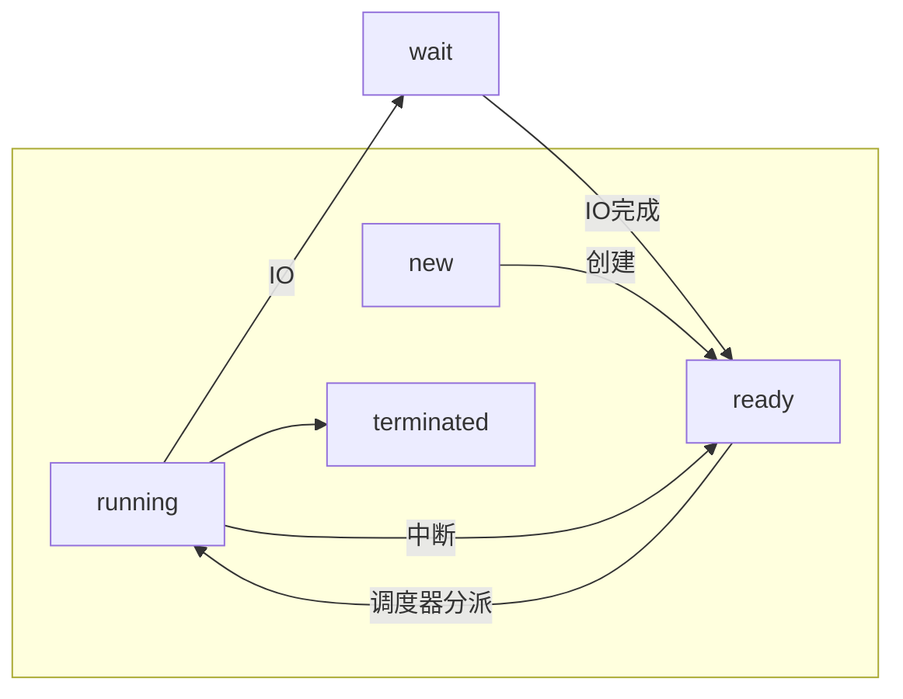

#### 调度的概念

进程一般由大量的短CPU区间（<8ms）和少量的长 CPU区间组成；

IO为主的程序短cpu区间多；cpu为主的程序长cpu区间少；

#### 调度程序

##### 非抢占调度、抢占调度

##### 分派程序⊇调度器

将CPU的控制权交给短期调度程序选择的进程，功能有：切换上下文、切换用户模式、跳转到用户程序的合适位置

分派延迟=停止一个进程启动另一个进程所要花的时间=切换上下文+切换用户模式+跳转到用户程序的合适位置>上下文切换的时间

#### 调度算法

#### 算法

1. 先到先服务调度(First Come, First Service Scheduling) ，产生**护航效果**
2. 优先级调度(Priority Scheduling) 

>抢占式：把手头的做完，再去考虑下一个最短的
>
>非抢占：直接中断去做最短的
>
>问题：**饥饿 (starvation) 或无限阻塞 (infinite blocking)**
>
>solution：老化

3. 最短作业优先调度(Shortest Job First Scheduling)

>有抢占/非抢占两种，是优先级调度的特例

4. 轮转法调度(Round Robin Scheduling) 

5. 多级队列调度(Multilevel Queue Scheduling) 

6. 多级反馈队列调度(Multilevel Feedback Queue Scheduling)：将就绪队列分成多个独立的队列

   >可以实现老化；
   >
   >1.队列内调度：
   >
   >>传统的FCFS调度，RR调度
   >>
   >>
   >
   >2.队列间调度：
   >
   >>固定优先级调度：前台队列比后台队列具有高优先级
   >>
   >>队列之间划分时间片： 每个队列都有给定的CPU时间， 在这段时间内可以调度队列内的进程
   >>
   >>例：前台进程放入前台队列，后台进程放入后台队列

##### 时间

周转时间（Turnaround Time) ：从进程**提交到完成**的时间段称为周转时间。周转时间为所有时间段之和，包括等待进入内存，在就绪队列中等待，在CPU上执行和I/O执行

等待时间（Waiting Time）：在就绪队列中等待的时间

响应时间（Response Time）：从提交请求到产生**第一**相应的时间。注意，它是开始响应所需要的时间，而不是输出响应所需要的时间（交互系统

##### 考虑因素

cpu使用率、吞吐量（一个时间单元内所完成的进程数量）、**三个时间**

#### 多处理器调度

##### 对称多处理（SMP）：每个处理器都在调度

> 需要保持负载平衡，负载平衡有push和pull两种方式

每个处理器有自己的调度算法

##### 非对称：只有一个处理器调度

>**软亲和性：**进程要在指定的 CPU 上尽量长时间地运行而不被迁移到其他CPU
>
>**硬亲和性**：不允许处理器之间的移动，只能在一个cpu上执行完

#### 线程调度

##### Local Scheduling

竞争发生在相同进程的线程之间

##### Global Scheduling

竞争发生在系统的所有线程之间

#### 实时调度

##### 实时系统

分为硬实时系统（具有硬截止时间，比如军用、医疗）和软实时系统（音频、视频）

三种任务：Periodic tasks（周期释放）、Aperiodic tasks（没ddl）、Sporadic tasks（间歇释放，有ddl）
