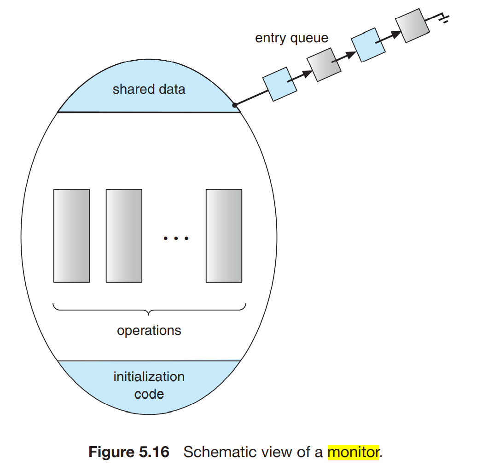

# 锁

作为线程同步章节的补充，本文旨在详细介绍各种锁，同时bridge the gap between `操作系统` and `具体语言（java&go）`中锁的实现。


互斥（一个资源只能由一个进程占用）；占用并等待；非抢占（资源不能被抢占）；循环等待；

## Pre-Knowledge

### Graph to present Deadlock

#### Resource-Allocation Graph


#### Wait-for Graph


### 4 necessary conditions causing deadlock

>`Mutual Exclusion`
>
>`Hold and Wait`
>
>`No preemption`
>
>`Circular Wait`

To prevent the deadlock, each of the conditions above corresponds to a solution:

>Prevent `Mutual Exclusion` (which is almost impossible!)
>
>Prevent `Circular Wait`: Defining a linear ordering of resource types (known as "有序资源使用法")

#### Strict Proof

why "Defining a linear ordering of resource types" could Prevent `Circular Wait`?

> **Theorem**
>
> If the sources are allocated to $P_i$ by "a linear ordering of resource types", then `circular wait` won't happen
>
> **Proof**
>
> Suppose there are $n$ processes $S_P={P_1, P_2, ..., P_n}$ and $m$ resources $S_R={R_1, R_2, ..., R_m}$, where each process requires a subset of the resources to complete its execution.
>
> define a linear ordering of resource types, such that each resource is assigned a unique numerical value, and these values represent the order in which the resources should be acquired. For simplicity, we can assume that the resources are numbered from 1 to $m$, and the ordering is such that $R_1 < R_2 < ... < R_m$.
>
> Assume for the sake of contradiction that the source are allocated to $P_i$ by "a linear ordering of resource types"  and `circular wait` still happen.
>
> Since there exists a circular wait, then: 
>
> w.l.o.g., assume that  $P_{a_1}$ currently holds a set resources  $s_1\ s_1 \subseteq S_R$, and $P_{a_1}$ is requiring the resource $R_{b_2}$,
>
> $P_{a_2}$ currently holds a set resources  $s_2\ s_2 \subseteq S_R$, and $P_{a_2}$ is requiring the resource $R_{b_3}$,
>
> ...
>
> $P_{a_k}$ currently holds a set resources  $s_k\ s_k \subseteq S_R$, and $P_{a_k}$ is requiring the resource $R_{b_1}$;
>
> Also, $P_{a_{j}} \in S_P,and\ R_{b_{i}} \in S_P$,  $R_{b_i} \in s_i$($R_{b_i} \in s_i$ holds because there is a deadlock!).
>
> simply express this as the following graph (which can help you understand the inferences above):
>
> (graph placeholder)
>
> 
>
> Since the resource are allocated by "a linear ordering of resource types", then $\forall R_{s_1} \in s_1, R_{s_1}<R_{b_2}$, similarly, $\forall R_{s_2} \in s_2, R_{s_2}<R_{b_3}$, ..., $\forall R_{s_k} \in s_k, R_{s_k}<R_{b_1}$.
>
> We also know that $R_{b_i} \in s_i$ from the condition above.
>
> Thus, we now have $R_{b_1}<R_{b_2},\ R_{b_2}<R_{b_3},\ ...,\ R{b_k}<R_{b_1}$. However, these inequalities do not hold simultaneously. 
>
> Therefore, the theorem is now proved to be true.∎
>
> 


## Locks in OS

### Mutex


### Semaphore

> "one needs both locks and condition variables to solve a broad range of relevant and interesting concurrency problems. One of the first people to realize this years ago was Edsger Dijkstra." (Remzi, P1, [threads-sema.pdf](https://pages.cs.wisc.edu/~remzi/Classes/537/Fall2021/Book/threads-sema.pdf))

Dijkstra says let there be semaphore, then there is semaphore. 

Semaphore is not a lock, but can be used a lock.

#### Application

##### Binary Sema(Locks)

##### Code running in order

##### Producer/Consumer

##### The Dining Philosophers

###### Background

The problem is that each philosopher needs two chopsticks to eat, one on the left and one on the right. If a philosopher takes a chopstick, it cannot be used by another philosopher until he/she puts it down. This leads to a potential deadlock where all the philosophers are holding one chopstick and waiting for the other one.

###### Code that not perfect


###### Solution

<font color=red>KEY: change how forks are acquired by at least one of the philosophers</font>


>

here simply using semaphore to break the **Circular wait** condition


##### Thread Throttling

#### Implementation


#### Flaws in Semaphore


### Monitor

monitor is used for multiple threads to access the shared resources exclusively

**composition of monitor**：<font color=red>A lock (control of exclusively access to the monitor code)；Multiple conditional variables and a series of corresponding operations（conditional variables are used to manage concurrent access, A conditional variable corresponds to a waiting queue, each variable has wait and signal operations）</font>




## 悲观锁

synchronized是悲观锁，可以修饰实例方法，静态方法，代码块。

synchronized基于互斥锁实现，在 Java 中，每个对象都有一个管程（Monitor），当线程进入 `synchronized` 代码块时，会尝试获取对象的管程，并在代码块执行完成后释放管程。当一个线程获取到了对象的管程后，其他线程就需要等待，直到当前线程释放管程。

>


>java 对象头：
>
>```java
>|---------------------------------------------------|
>| Object Header (64 bits)                           |
>|-------------------------|-------------------------|
>| Mark Word (32 bits)     | Klass Word (32 bits)    |
>|-------------------------|-------------------------|
>```
>
>数组对象：
>
>```java
>|--------------------------------------------------------------------------|
>| Object Header (96 bits)                                                  |
>|-------------------------|-----------------------|------------------------|
>| Mark Word(32bits)       | Klass Word(32bits)    | array length(32bits)   |
>|-------------------------|-----------------------|------------------------|
>```
>
>mark word结构：
>
>```java
>|-------------------------------------------------------|--------------------|
>| Mark Word (32 bits)                                   | State              |
>|-------------------------------------------------------|--------------------|
>| hashcode:25         | age:4 | biased_lock:0   | 01    | Normal             |
>|-------------------------------------------------------|--------------------|
>| thread:23 | epoch:2 | age:4 | biased_lock:1   | 01    | Biased             |
>|-------------------------------------------------------|--------------------|
>| ptr_to_lock_record:30                         | 00    | Lightweight Locked |
>|-------------------------------------------------------|--------------------|
>| ptr_to_heavyweight_monitor:30                 | 10    | Heavyweight Locked |
>|-------------------------------------------------------|--------------------|
>|                                               | 11    | Marked for GC      |
>|-------------------------------------------------------|--------------------|
>
>```
>
>
>
>


